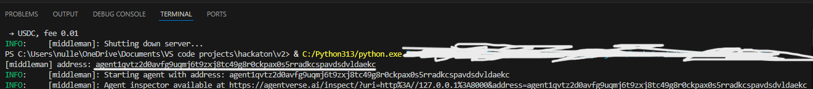

# Middleman_IO

A demo version of an escrow system that can be used for exchanging mainly crypto ,but when its finished with AI capabilities it can be used for absolutely everything.

## How to run

Run to install the libraries
```
pip install -r requirements
```
First you need to run the midlleman and get his address from the output of the program

After that paste the address in the designated places in the buyer and seller scripts.

## Running
Middleman should be running at all time.
If you are running in VS code the easiest way be running all scripts at the same is to run them in a deddicated terminal.


Run seller and select what you want to sell and buy for.
The currencies for now are:
```
SOL, BTC, ETH, USDC, USDT
```
You select the amount and if there isnt enough demo balance in balances.json it wont allow to send the message to the middleman. If everything is ok the message will be sent and accepted by the middleman. After its accepted and stored you need to run the buyer.
The buyer will get the offers and will accept the one he likes and the funds will be exchanged in balances.json
## Bugs

- Buyer can double accept offer even when its deleted and it bugs the protgram
- There are sometimes rounding errors

## What to add

- Make it on-chain
- add AI functuality
- Make it work for outside machines
- Make it decentralised

## Team
Im the only team member for now. This is one of my first more serious projects that i have done in a while.

